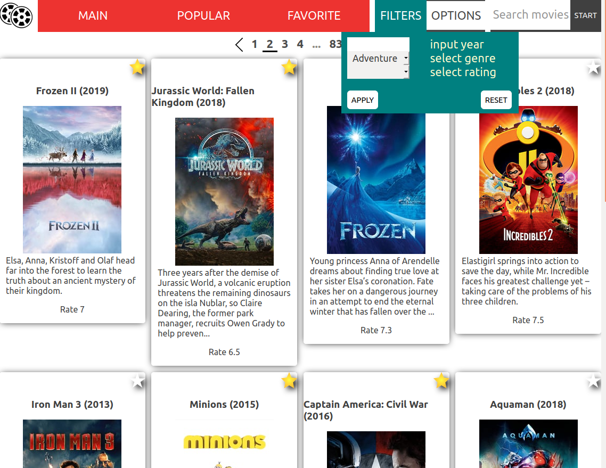
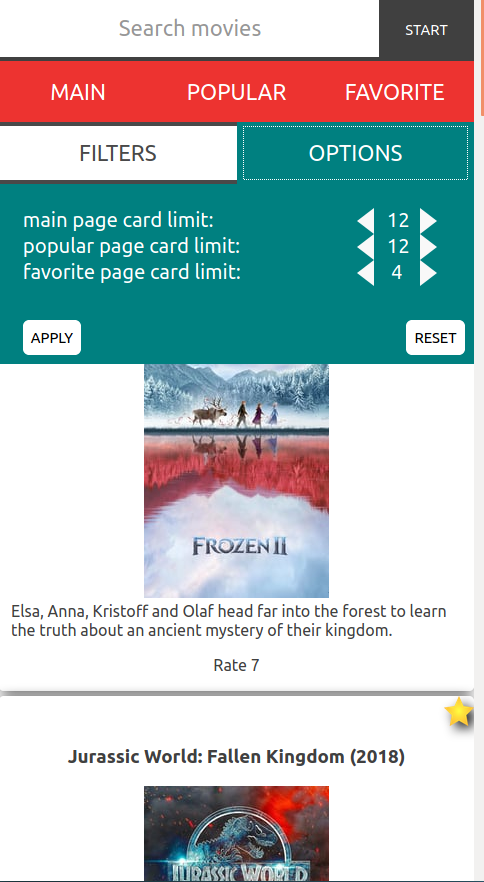

# Cinema info web app

## Description
This web page provides brief an information about all kind of movies. The data is taken from [The movie db](https://www.themoviedb.org) API. 
 

 
 

## Technology stack
ES6+, Webpack, Babel, React, Redux, propTypes, css-modules

## Development
If you want to make contribution to this project, just do the following: 
* Install [NodeJS](https://nodejs.org/en/download/) [Npm](https://docs.npmjs.com/cli/install) and [Git](https://www.atlassian.com/git/tutorials/install-git) to your computer.
* Open the console and clone this repository with your git to computer  
`git clone https://gitlab.allbugs.info/cinema-app/oleksiis/cinema-app.git`  
* Navigate your console inside the cloned folder  
`cd /[your path]/cinema-app`  
* Input in console: 
`npm install` 
Wait until installation finished and then:  
`npm start` 
Latest version of the website starts at: 
[http://localhost:7000/](http://localhost:7000/)

## Usage
Follow this link [Cinema app](http://localhost:7000/)

## Contributing
Alex Smirnov

